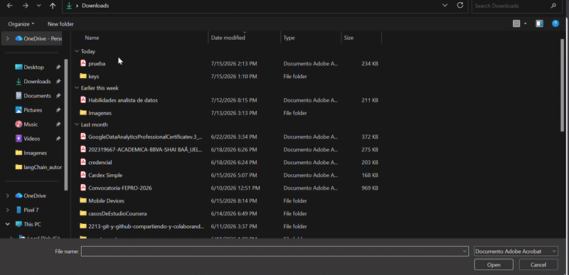
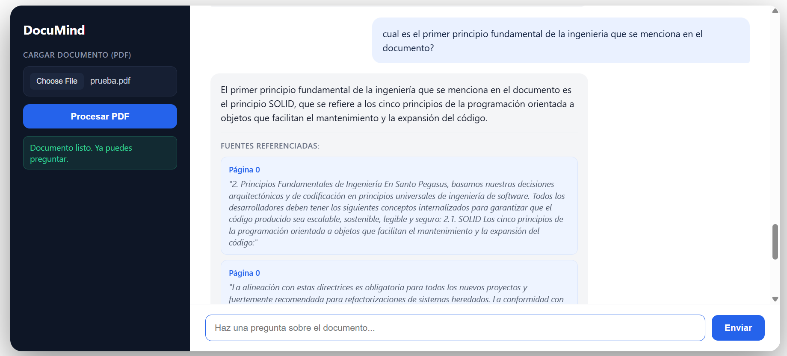
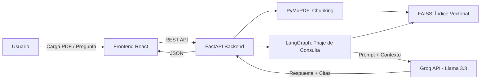

# DocuMind: Agente IA de Análisis de Documentos


**DocuMind** es una solución Full-Stack diseñada para procesar, vectorizar y consultar documentos PDF de forma inteligente. 
Utiliza técnicas de **RAG (Retrieval-Augmented Generation)** para extraer información precisa y responder preguntas basadas exclusivamente 
en el contexto del archivo cargado.
```
Link de pagina: http://129.151.54.245
```

---

## Demostración del funcionamiento

### Flujo de procesamiento de documentos


### Ejemplo de consulta


---

## Características principales

- **Procesamiento inteligente**: carga y fragmentación (*chunking*) de archivos PDF mediante `PyMuPDF`.
- **Búsqueda semántica**: búsqueda vectorial con `FAISS` y modelos multilingües de `HuggingFace`.
- **Agente cognitivo**: flujo de trabajo basado en `LangGraph` para realizar triaje de consultas (auto-resolución, aclaración o fuera de alcance).
- **Backend escalable**: API REST construida con `FastAPI` para una comunicación fluida.
- **Interfaz moderna**: frontend en `React` con `TypeScript`, estilizado con CSS moderno.
- **Despliegue portable**: contenerización completa con `Docker` y `Docker Compose`.

---

##  Stack tecnológico

| Categoría        | Tecnologías |
|-------------------|-------------|
| **Backend**       | Python, FastAPI, LangChain, LangGraph, Groq API (Llama 3.3) |
| **Frontend**      | React, TypeScript, Vite |
| **Infraestructura**| Docker, Docker Compose, Nginx |
| **IA / ML**       | FAISS (Vector DB), Sentence-Transformers |

---

##  Arquitectura



El flujo general es: el usuario carga un PDF, que se fragmenta e indexa vectorialmente con FAISS. Cada pregunta pasa por un agente en
LangGraph que decide si puede responderse con el contexto disponible, si necesita aclaración, o si está fuera de alcance, antes de generar 
la respuesta final con el modelo de Groq.

---

## Requisitos previos

- [Docker Desktop](https://www.docker.com/products/docker-desktop/) instalado y en ejecución.
- Una API key de Groq (gratuita): consíguela en [console.groq.com](https://console.groq.com).

---

## Cómo ejecutar el proyecto

**1. Clonar el repositorio**

```bash
git clone https://github.com/tu-usuario/DocuMind.git
cd DocuMind
```

**2. Configurar variables de entorno**

Crea un archivo `.env` en la raíz del proyecto y agrega tu llave de Groq y URL de Vite:

```
GROQ_API_KEY=tu_llave_aqui
```
```
VITE_API_URL=http://localhost:8000
```

**3. Levantar los servicios**

Asegúrate de tener Docker Desktop en ejecución y corre:

```bash
docker compose up --build
```

**4. Acceder a la aplicación**

Abre tu navegador en [http://localhost](http://localhost)

---

## Estructura del proyecto

```
DocuMind/
├── backend/            # API FastAPI y lógica del agente
├── frontend/           # Interfaz React (TypeScript)
├── docker-compose.yml  # Orquestación de servicios
└── .env                # Variables de entorno (no versionado)
```

---

## Licencia

Este proyecto es de código abierto. Siéntete libre de utilizarlo, modificarlo y mejorarlo.

---

Desarrollado por ShaiBG0
